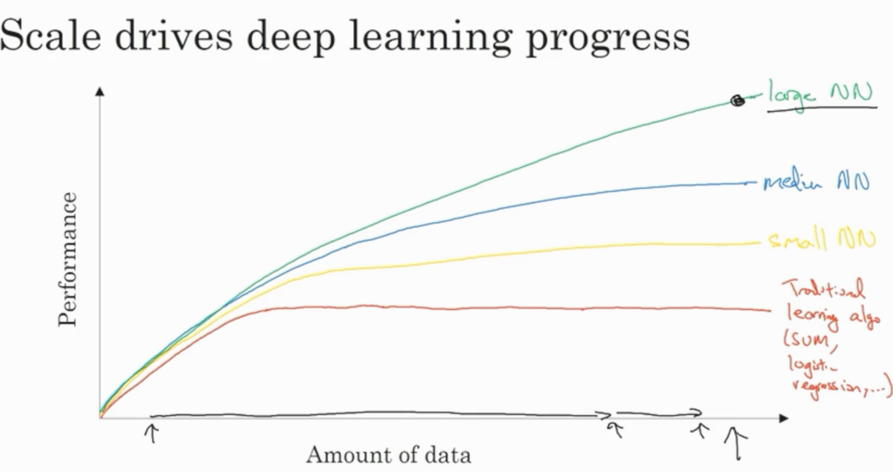
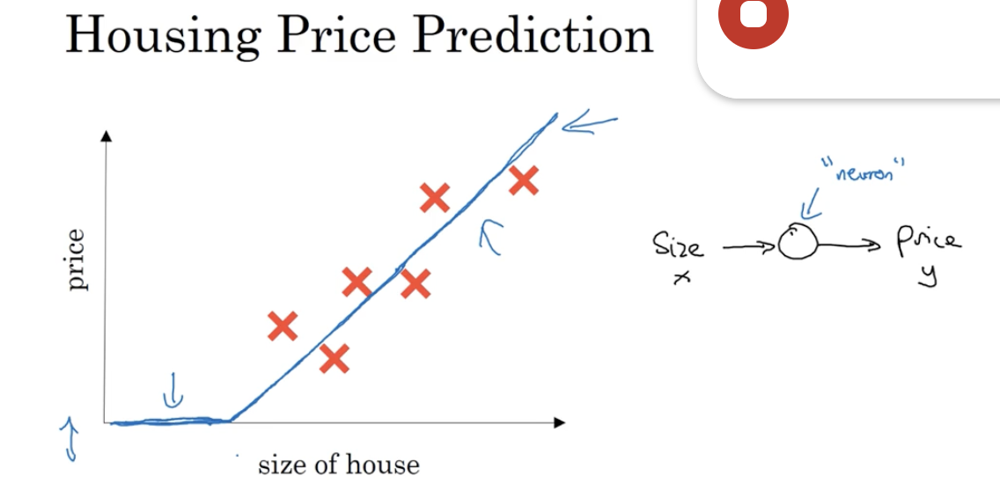
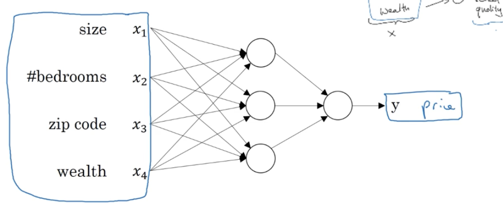
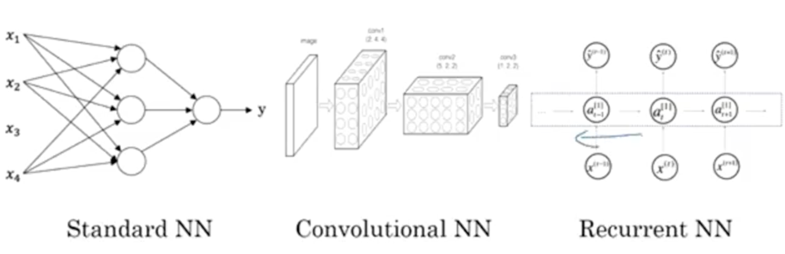
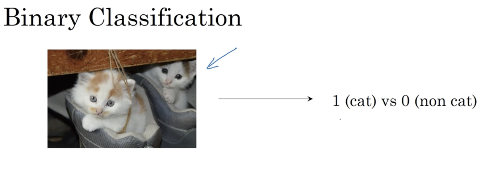
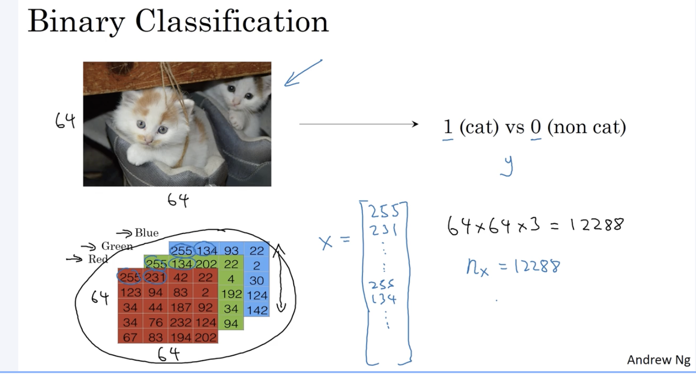
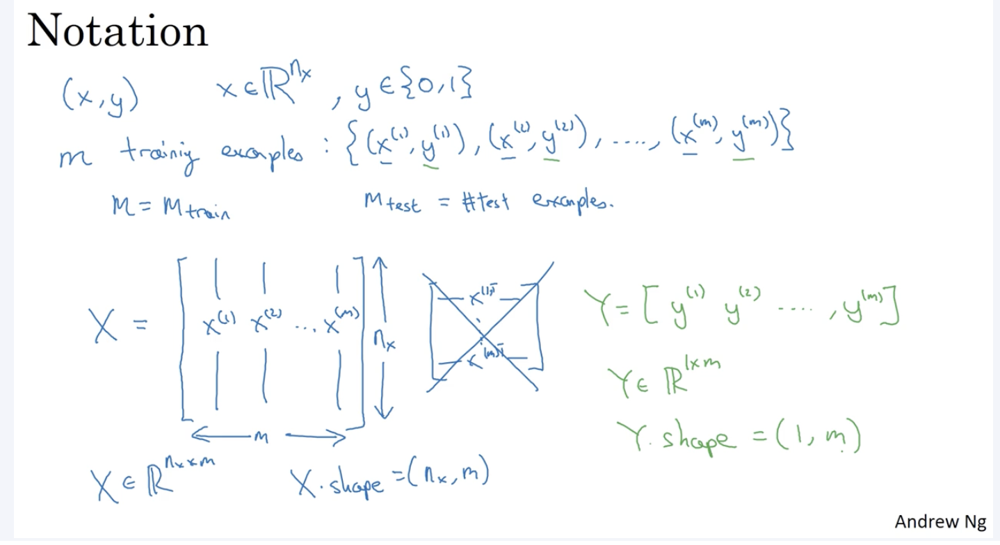
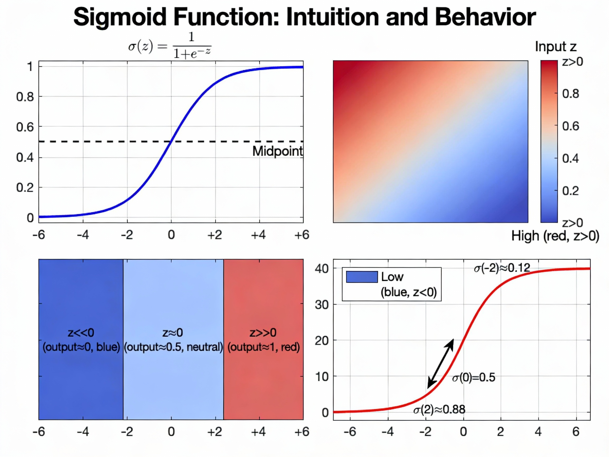
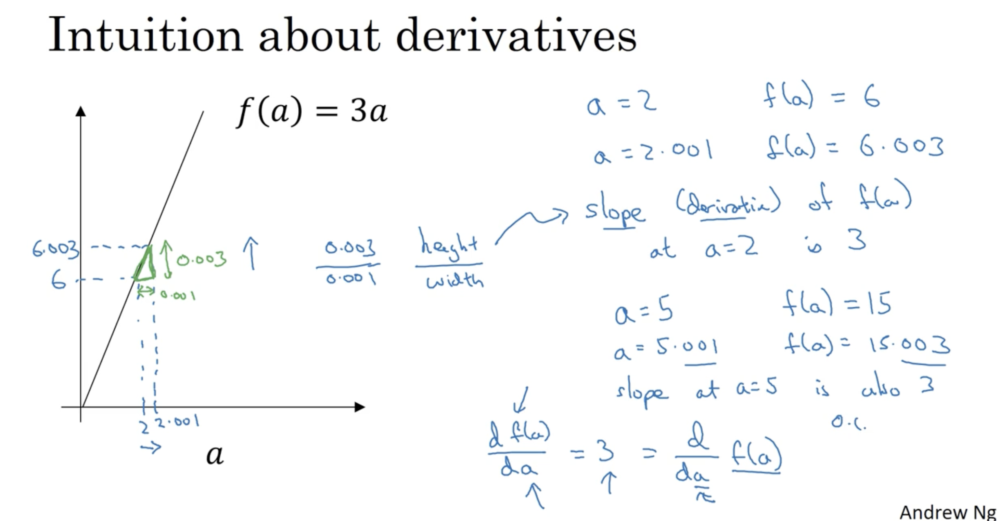
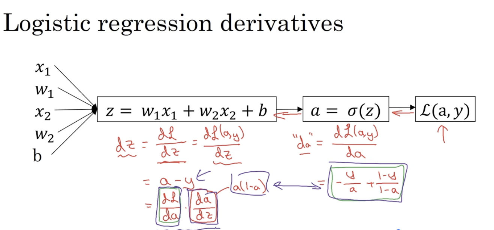

# Course 1: Neural Networks and Deep Learning

**Date Started:** 2026-01-19

---

## Week 1: Introduction to Deep Learning

### Lecture Outline
- What is a neural network?
- Supervised learning with neural networks
- Why is deep learning taking off?

### Key Concepts & Definitions
- **Neural Network**: A computational model inspired by biological neural networks
- **Supervised Learning**: Learning from labeled data
- **Deep Learning**: Neural networks with multiple hidden layers

### Important Formulas
| Formula | Meaning / Use |
|---------|---------------|
| $z = w^T x + b$ | Linear transformation |
| $a = g(z)$ | Activation function |

### Examples

- Worked example 2: ...

### Questions I Still Have
- What about ...
- Why does ...

---

## Week 2: Neural Networks Basics

### Lecture Outline
- Binary classification

Where m is the number of training examples

- Logistic regression
Used for Binary Classification

Logistic Regression Loss Function

- Gradient descent
- Derivatives

- Computation graph
- Vectorization

### Key Concepts & Definitions
- **Logistic Regression**: Classification algorithm using sigmoid activation
- **Gradient Descent**: Optimization algorithm to minimize cost function

Function is convex. 
- **Forward Propagation**: Computing predictions from input to output
- **Backward Propagation**: Computing gradients from output to input
- ** Loss Function** :
Computes error for single training sample
- ** Cost Function **  : 
Average of loss functions over the full training set

### Tips & Tricks
- **Avoid Rank 1 Arrays**: In Python/NumPy, always use explicit row vectors `(1, n)` or column vectors `(n, 1)` instead of rank 1 arrays `(n,)`. Rank 1 arrays can cause unexpected broadcasting behavior and bugs in deep learning implementations.
  - ❌ Bad: `a = np.random.randn(5)` → shape is `(5,)` (rank 1 array)
  - ✅ Good: `a = np.random.randn(5, 1)` → shape is `(5, 1)` (column vector)
  - ✅ Good: `a = np.random.randn(1, 5)` → shape is `(1, 5)` (row vector)
  - Use `a.reshape(5, 1)` or `a.reshape(1, 5)` to convert rank 1 arrays to proper vectors
  - Always check shapes with `assert(a.shape == (5, 1))` to catch these issues early

### Important Formulas
| Formula | Meaning / Use |
|---------|---------------|
| $\sigma(z) = \frac{1}{1 + e^{-z}}$ | Sigmoid activation function |
| $J = -\frac{1}{m}\sum_{i=1}^{m}[y^{(i)}\log(a^{(i)}) + (1-y^{(i)})\log(1-a^{(i)})]$ | Binary cross-entropy loss |

### Examples
- Worked example 1: ...
- Worked example 2: ...

### Questions I Still Have
- What about ...
- Why does ...

---

## Week 3: Shallow Neural Networks

### Lecture Outline
- Neural network representation
- Computing a neural network's output
- Vectorizing across multiple examples
- Activation functions
- Gradient descent for neural networks
- Backpropagation intuition

### Key Concepts & Definitions
- **Hidden Layer**: Intermediate layer between input and output
- **Activation Function**: Non-linear function applied to neuron output
- **Vectorization**: Computing operations on entire datasets at once

### Important Formulas
| Formula | Meaning / Use |
|---------|---------------|
| $a^{[l]} = g^{[l]}(z^{[l]})$ | Layer activation |
| $z^{[l]} = W^{[l]}a^{[l-1]} + b^{[l]}$ | Linear transformation |

### Examples
- Worked example 1: ...
- Worked example 2: ...

### Questions I Still Have
- What about ...
- Why does ...

---

## Week 4: Deep Neural Networks

### Lecture Outline
- Deep L-layer neural network
- Forward propagation in a deep network
- Getting your matrix dimensions right
- Why deep representations?
- Building blocks of deep neural networks
- Parameters vs hyperparameters

### Key Concepts & Definitions
- **Deep Neural Network**: Network with multiple hidden layers
- **Hyperparameters**: Parameters that control the learning process (learning rate, number of layers, etc.)
- **Parameters**: Weights and biases learned during training

### Important Formulas
| Formula | Meaning / Use |
|---------|---------------|
| $dW^{[l]} = \frac{\partial J}{\partial W^{[l]}}$ | Gradient w.r.t. weights |
| $db^{[l]} = \frac{\partial J}{\partial b^{[l]}}$ | Gradient w.r.t. bias |

### Examples
- Worked example 1: ...
- Worked example 2: ...

### Questions I Still Have
- What about ...
- Why does ...
